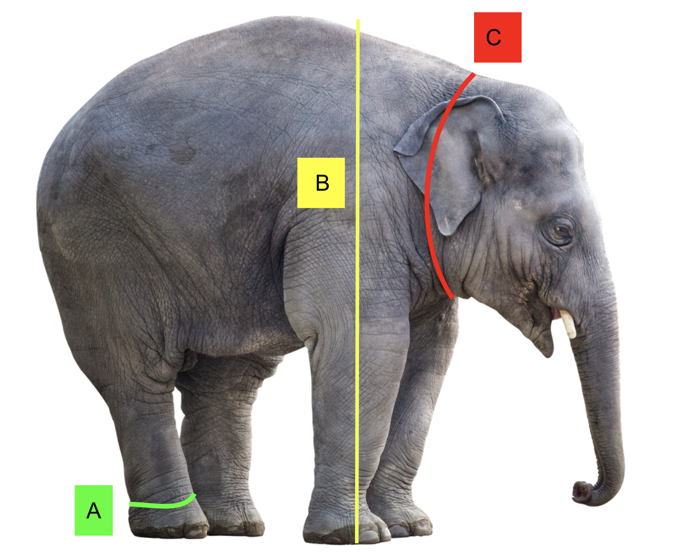

class: middle, left 
background-image:url('2_stone.jpeg')
background-position: 90% 80%
background-size: 100%


```{r setup, include=FALSE}
options(htmltools.dir.version = FALSE)
knitr::opts_chunk$set(
  out.width = "100%",
  cache = FALSE,
  echo = TRUE,
  message = FALSE, 
  warning = FALSE,
  fig.show = TRUE,
  hiline = TRUE
)
```

<style type="text/css">
.remark-slide-content {
    font-size: 45px;
}
</style>


### <span style="color:#040a47">PhD in Statistics, Monash University, Australia</span>

--

### <span style="color:#040a47">Senior Lecturer, University of Sri Jayewardenepura </span>

--

### <span style="color:#040a47">Associate Investigator of the Australian Research Council Centre of Excellence for Mathematical and Statistical Frontiers (ACEMS), Australia</span>

--

### <span style="color:#040a47">Co-founder and Co-organizer, R-Ladies Colombo (Chapter - R Ladies Global)</span>

--


## <span style="color:#630008">BSc (Hons) Special Degree  in Statistics, USJ</span>

## <span style="color:black">Batch first and Professor R A Dayananda  Gold Medalist</span>


---
class: center, middle

# What is Statistics?

--
The science of collecting, analyzing, presenting, and interpreting data. 

---

class: center, middle

# What is Statistics?

The science of collecting, analyzing, presenting, and interpreting **data**.

---

.pull-left[


]


---

.pull-left[


]

.pull-right[


]


---


.pull-left[

**Tabular data**


]

.pull-right[


]

---
background-image: url(i4.png)
background-size: contain


---


.pull-left[

Tabular data


]

.pull-right[

**Image data**


]

---


.pull-left[

Tabular data


**Audio data**


]

.pull-right[

Image data


]


---


.pull-left[

Tabular data


Audio data


]

.pull-right[

Image data


**Video data**

<iframe width="560" height="315" src="https://www.youtube.com/embed/398Zcag0Pw8" title="YouTube video player" frameborder="0" allow="accelerometer; autoplay; clipboard-write; encrypted-media; gyroscope; picture-in-picture" allowfullscreen></iframe>

]


---

class: center, middle

# What is Statistics?

The science of **collecting**, analyzing, presenting, and interpreting **data**.

---

class: center, middle

# What is Statistics?

The science of collecting, **analyzing**, presenting, and interpreting **data**.

---
background-image: url(orange.jpeg)
background-size: cover

# Data analysis

---

.pull-left[

```{r, comment=NA, echo=FALSE}
ID <- 1:100
g1 <- c("Male", "Female", "Female", "Female", "Female", "Male", "Male", "Male") 
Gender <- c(g1, rep("Female", 46), rep("Male", 46))
b2 <- rnorm(46, mean=3.5) 
b3 <- rnorm(46, mean=3)
w2 <- 1000*b2 + rnorm(46, mean=100)
w3 <- 1500*b3 + rnorm(46, mean=100)
b1 <- c(3.6, 2.5, 4, 4.5, 3, 3.9, 4.2, 4.6)
w1 <- c(4000, 5000, 6000, 7000, 7550, 4500, 3375, 5500)
B <- round(c(b1, b2, b3), 1)
Weight <- round(c(w1, w2, w3), 0)
a1 <- c(80, 90, 110, 100, 91.5, 92, 88, 70) 
a2 <- rnorm(92, mean=100)
A <- round(c(a1, a2), 1)
c1 <- c(2.5, 6.3, 4.5, 3.2, 3.5, 3.7, 3.8, 3.9)
c2 <- rnorm(92, mean=3.5)
C <- round(c(c1, c2), 1)
df <- data.frame(ID, Gender, A, B, C, Weight)
df
```
]

--

.pull-right[

```{r, echo=FALSE, comment=NA, warning=FALSE, message=FALSE}

library(ggplot2)
ggplot(data=df, aes(x=B, y=Weight)) + 
  geom_point() + ggtitle("Scatterplot of weight (kg) vs B (ft)") +
  xlab("B (ft)") + ylab("Weight (kg)") + theme(plot.title = element_text(hjust = 0.5))
```

]


---

.pull-left[

```{r, comment=NA, echo=FALSE}
ID <- 1:100
g1 <- c("Male", "Female", "Female", "Female", "Female", "Male", "Male", "Male") 
Gender <- c(g1, rep("Female", 46), rep("Male", 46))
b2 <- rnorm(46, mean=3.5) 
b3 <- rnorm(46, mean=3)
w2 <- 1000*b2 + rnorm(46, mean=100)
w3 <- 1500*b3 + rnorm(46, mean=100)
b1 <- c(3.6, 2.5, 4, 4.5, 3, 3.9, 4.2, 4.6)
w1 <- c(4000, 5000, 6000, 7000, 7550, 4500, 3375, 5500)
B <- round(c(b1, b2, b3), 1)
Weight <- round(c(w1, w2, w3), 0)
a1 <- c(80, 90, 110, 100, 91.5, 92, 88, 70) 
a2 <- rnorm(92, mean=100)
A <- round(c(a1, a2), 1)
c1 <- c(2.5, 6.3, 4.5, 3.2, 3.5, 3.7, 3.8, 3.9)
c2 <- rnorm(92, mean=3.5)
C <- round(c(c1, c2), 1)
df <- data.frame(ID, Gender, A, B, C, Weight)
df
```
]


.pull-right[

```{r, echo=FALSE, comment=NA, warning=FALSE, message=FALSE}

library(ggplot2)
p1 <- ggplot(data=df, aes(x=B, y=Weight, col=Gender)) + 
  geom_point() + 
  ggtitle("Scatterplot of weight (kg) vs B (ft)")+
  xlab("B (ft)") + ylab("Weight (kg)") + theme(plot.title = element_text(hjust = 0.5)) + scale_colour_manual(values = c("#e7298a","#1b9e77", "green"))
p1
```

]


---

.pull-left[

```{r, comment=NA, echo=FALSE}
ID <- 1:100
g1 <- c("Male", "Female", "Female", "Female", "Female", "Male", "Male", "Male") 
Gender <- c(g1, rep("Female", 46), rep("Male", 46))
b2 <- rnorm(46, mean=3.5) 
b3 <- rnorm(46, mean=3)
w2 <- 1000*b2 + rnorm(46, mean=100)
w3 <- 1500*b3 + rnorm(46, mean=100)
b1 <- c(3.6, 2.5, 4, 4.5, 3, 3.9, 4.2, 4.6)
w1 <- c(4000, 5000, 6000, 7000, 7550, 4500, 3375, 5500)
B <- round(c(b1, b2, b3), 1)
Weight <- round(c(w1, w2, w3), 0)
a1 <- c(80, 90, 110, 100, 91.5, 92, 88, 70) 
a2 <- rnorm(92, mean=100)
A <- round(c(a1, a2), 1)
c1 <- c(2.5, 6.3, 4.5, 3.2, 3.5, 3.7, 3.8, 3.9)
c2 <- rnorm(92, mean=3.5)
C <- round(c(c1, c2), 1)
df <- data.frame(ID, Gender, A, B, C, Weight)
df
```
]


.pull-right[

```{r, echo=FALSE, comment=NA, warning=FALSE, message=FALSE}
library(plotly)
ggplotly(p1)
```

]

---
background-image: url(i7.png)
background-size: cover

---

class: center, middle

# What is Statistics?

The science of collecting, analyzing, **presenting, and interpreting** **data**.


---
class: center, middle

# Myth-busting Statistics

--

Popular Myths (**false beliefs**) about statistics

---
class: inverse, center, middle

**Myth 1**

**Statistics is a boring subject.**


---
class: inverse, center, middle

~~**Myth 1**~~

**Statistics is a** ~~**boring subject**~~.


 # **Statistics is a** very interesting and useful subject with so many applications.
 
---
background-image: url(i8.png)
background-size: contain


---
background-image: url(i9.jpeg)
background-size: contain

---
background-image: url(l2.png)
background-size: contain

---
background-image: url(l1.png)
background-size: contain

---
class: inverse, center, middle

**Myth 2**

**Statistics hasn't changed much in years. It is just the same old stuff.**


---
class: inverse, center, middle

~~**Myth 2**~~

~~**Statistics hasn't changed much in years. It is just the same old stuff.**~~

## The field of statistics has evolved significantly over time. It has also become a main componenet of many other disciplines.

---

# Ross Ihaka and Robert Gentleman

.pull-left[
```{r  echo=FALSE, out.height= "100%", fig_align = 'up'}
knitr::include_graphics("rr.jpg")
```

 ]
 
.pull-right[

- Originators of the R programming language

- R is a free software environment for statistical computing and graphics


]

---
# Hadley Wickham: Chief Scientist at RStudio

.pull-left[
```{r  echo=FALSE, out.width= "100%"}
knitr::include_graphics("HadleyWickham.png")
```
 ]
.pull-right[


- International COPSS Presidents' Award in 2019 for "influential work in statistical computing, visualisation, graphics, and data analysis"
]


---

# Robert Tibshirani

.pull-left[
```{r  echo=FALSE, out.width= "100%"}
knitr::include_graphics("Robert_tibshirani.png")
```
 ]
.pull-right[

-  Professor in Statistics and Biomedical Data Science at Stanford University


- Received the COPSS Presidents' Award in 1996
]

---
# Trevor Hastie

.pull-left[
```{r  echo=FALSE, out.width= "100%"}
knitr::include_graphics("TrevorHastie.png")
```
 ]
.pull-right[

- Hastie is known for his contributions to applied statistics, especially in the field of machine learning, data mining, and bioinformatics.


]

---

# Andrew Ng

.pull-left[
```{r  echo=FALSE, out.width= "70%", fig_align = 'up'}
knitr::include_graphics("Andrew_Ng.jpg")
```
 ]
.pull-right[

-  Undergraduate degree with a triple major in computer science, **statistics**, and economics

- Co-founded and led Google Brain, Coursera and deeplearning.ai


]

---
background-image: url(network.png)
background-size: contain

---
class: inverse, center, middle

**Myth 3**

**We now have AI and Machine Learning. So, we don't need statistics any more.**

---
class: inverse, center, middle

~~**Myth 3**~~

~~**We now have AI and Machine Learning. So, we don't need statistics any more.**~~

## Statistics plays a vital role in AI and Machine Learning.

---

<iframe width="1060" height="615" src="https://www.youtube.com/embed/pnInsXb8YLc" title="YouTube video player" frameborder="0" allow="accelerometer; autoplay; clipboard-write; encrypted-media; gyroscope; picture-in-picture" allowfullscreen></iframe>

---

# Right to Information

.pull-left[

```{r  echo=FALSE, out.width= "100%", fig_align = 'up'}

```


]

.pull-right[

```{r  echo=FALSE, out.width= "100%", fig_align = 'up'}

```


]

---
class: inverse, center, middle

**Myth 4**

**A statistician's work can be replaced by a computer, because it is all about performing certain numerical calculations.**

---
class: inverse, center, middle

~~**Myth 4**~~

~~**A statistician's work can be replaced by a computer, because it is all about performing certain numerical calculations.**~~

## Data scientists and statisticians are consistently ranked as the best jobs in the world.

---
background-image: url(job.png)
background-size: contain


---

class: inverse, center, middle

**Myth 5**

**Statisticians are boring and unsociable.**

---
class: inverse, center, middle

~~**Myth 6**~~

~~**Statisticians are boring and unsociable.**~~

## The joy of research is coupled with the task of sharing those discoveries with others.

--

## Learn to Travel. Travel to Learn.
---
background-image: url(stat.png)
background-size: cover

---
background-image: url(nc1.png)
background-size: contain

---
background-image: url(nc2.png)
background-size: contain

---
class: inverse, center, middle

**Myth 7**

**If a person knows probability theory, he/she can become a millionaire by participating in lotteries.**

---
class: inverse, center, middle

~~**Myth 7**~~

~~**If a person knows probability theory, he/she can become a millionaire by participating in lotteries.**~~

## If a person knows probability theory, he/she knows why he **can't** become a millionaire by participating in lotteries.

---
background-image: url(c1.png)
background-size: contain

---
background-image: url(c2.png)
background-size: contain

---
background-image: url(c3.png)
background-size: contain

---
background-image: url(c4.png)
background-size: contain

---
# What skills and qualifications are required for data science-related jobs?

Link: https://thiyangt.github.io/DSjobtraker_2022_dashboard/

```{r  echo=FALSE, out.width= "20%", fig_align = 'up'}
knitr::include_graphics("hexsticker.png")
```


---
background-image: url(ds1.png)
background-size: contain

---
background-image: url(ds2.png)
background-size: contain

---
class: inverse, middle, center

# Three Key Ingredients

---
background-image: url(home.jpg)
background-size: contain

**Physical space**

---
background-image: url(mental.png)
background-size: contain

**Mental space**

---
background-image: url(calendar.jpeg)
background-size: contain

**Calendar space**


---
## References

Le Dinh, T., Lee, S. H., Kwon, S. G., & Kwon, K. R. (2022). COVID-19 Chest X-ray Classification and Severity Assessment Using Convolutional and Transformer Neural Networks. Applied Sciences, 12(10), 4861.

## Acknowledgement

Prof Kate Smith-Miles - Myth-busting Mathematics
